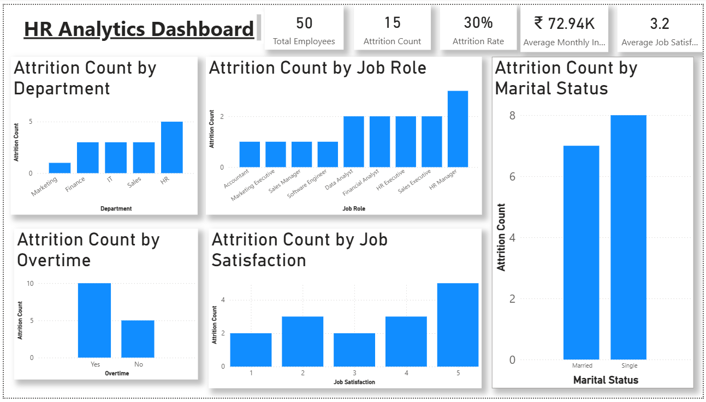

# HR Analytics Dashboard

An interactive HR Analytics Dashboard built using Power BI to analyze employee attrition and identify patterns related to departments, job roles, overtime, job satisfaction, and marital status.

## Business Problem

Employee attrition is an important challenge for organizations because high employee turnover can increase recruitment and training costs.

The objective of this project is to analyze employee attrition and identify patterns across different departments, job roles, overtime status, job satisfaction levels, and marital status.

The dashboard helps HR teams understand employee turnover patterns and identify areas where employee retention strategies may be needed.\


## Dataset Description

The dataset contains employee-level information used to analyze employee attrition.

### Dataset Details

- **Total Employees:** 50
- **Total Columns:** 14
- **Target Variable:** Attrition
- **Attrition Values:** Yes / No

### Important Columns

| Column | Description |
|---|---|
| Employee ID | Unique identifier for each employee |
| Age | Age of the employee |
| Gender | Gender of the employee |
| Department | Department where the employee works |
| Job Role | Job position of the employee |
| Monthly Income | Monthly salary of the employee |
| Years at Company | Number of years the employee has worked |
| Job Satisfaction | Job satisfaction rating from 1 to 5 |
| Overtime | Whether the employee works overtime |
| Marital Status | Marital status of the employee |
| Attrition | Whether the employee left the company |

The dataset is used to identify patterns and factors related to employee attrition.


## Dataset Description

The dataset contains employee-level information used to analyze employee attrition.

The dataset includes 50 employee records and 14 columns.

Key columns include:

- Employee ID
- Age
- Gender
- Department
- Job Role
- Monthly Income
- Years at Company
- Job Satisfaction
- Marital Status
- Overtime
- Work-Life Balance
- Joining Date
- Education
- Attrition

## Data Cleaning

The dataset was cleaned and prepared using Power Query in Power BI.

The following data quality checks were performed:

- Checked for null values
- Checked for duplicate Employee IDs
- Removed unnecessary columns
- Verified and corrected data types
- Ensured Monthly Income is in numeric format
- Ensured Age is in whole number format
- Converted Joining Date to date format
- Verified Attrition values as Yes/No

## DAX Measures

The following DAX measures were created to calculate key HR metrics:

### Total Employees

```DAX
Total Employees = COUNTROWS(HR_Analytics)
```
Attrition Count =
CALCULATE(
    COUNTROWS(HR_Analytics),
    HR_Analytics[Attrition] = "Yes"
)

Attrition Rate =
DIVIDE(
    [Attrition Count],
    [Total Employees],
    0
)

Average Job Satisfaction =
AVERAGE(HR_Analytics[Job Satisfaction])

Average Monthly Income =
AVERAGE(HR_Analytics[Monthly Income])

These measures were used to create KPI cards and analyze employee attrition patterns across different categories.

## Key Insights

The dashboard provides the following key insights:

- The overall employee attrition rate is 30%.
- 15 out of 50 employees have left the company.
- Employees working overtime show higher attrition compared to employees who do not work overtime.
- The HR department has the highest attrition count among the departments.
- HR Manager has the highest attrition count among the job roles.
- Attrition is higher among single employees compared to married employees.
- The dashboard helps identify the relationship between job satisfaction and employee attrition.

## Business Recommendations

Based on the analysis, the following recommendations can help reduce employee attrition:

- Review overtime policies and monitor employees who work excessive overtime.
- Focus on improving employee retention in the HR department.
- Identify the reasons behind higher attrition among HR Managers.
- Conduct employee satisfaction surveys to understand employee concerns.
- Provide better career growth and development opportunities.
- Monitor employee workload and work-life balance.
- Develop targeted retention strategies for employees who are at higher risk of leaving.

## Dashboard Preview


